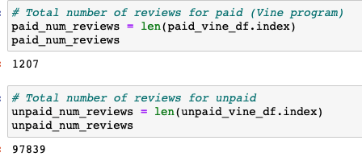
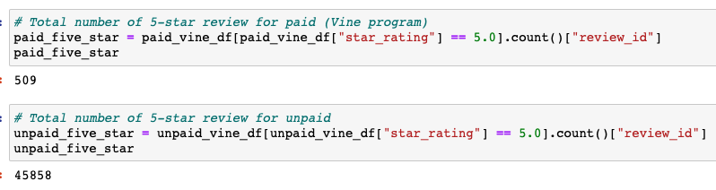

# Amazon_Vine_Analysis
## Overview of the analysis
- The purpose of this project is to analyze Amazon reviews for kitchen products which I picked from the Amazon Review datasets. I performed ETL process on kitchen product reviews and compared the reviews written by members of the paid Vine program and people who were not paid to see if there is any positivity bias towards the Vine reviews. 

## Results
- There were 1,207 Vine reviews and 97,839 non-Vine reviews.

- 509 out of 1,207 Vine reviews were 5 stars and 45,858 out of 97,839 non-Vine reviews were 5 stars.  

- 42.17% of Vine reviews were 5 stars and 46.87% of non-Vine reviews were 5 stars.

## Summary
- As mentioned the above, 42.17% of reviews written by the member of paid Vine programs were 5 stars and 46.87% of reviews written by unpaid people were 5 stars. Since the percentage of 5-star reviews for the unpaid reviews is greater than the percentage of 5-star reviews for the paid Vine program, there is no positivity bias for reviews in the paid Vine program. 
- I would recommend to find the average star ratings for all Vine and non-Vine reviews and check if there is any big difference. 

